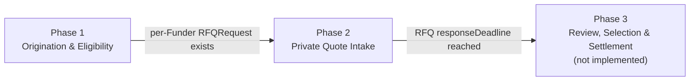
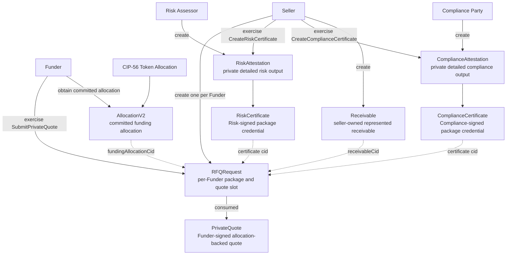
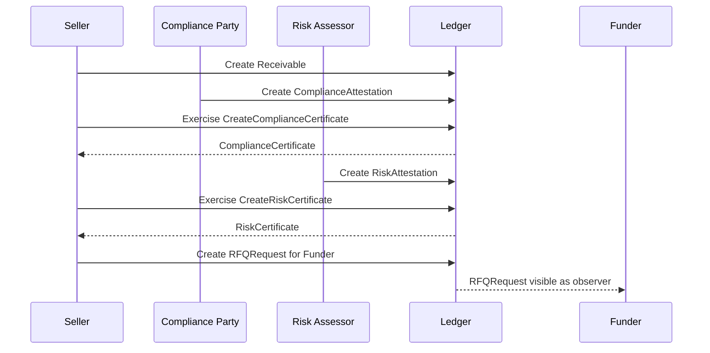
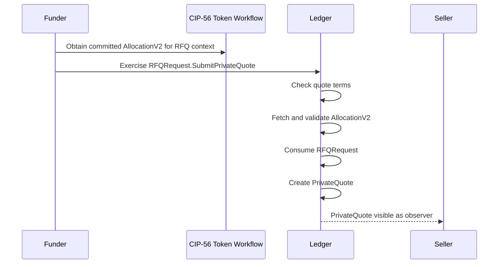
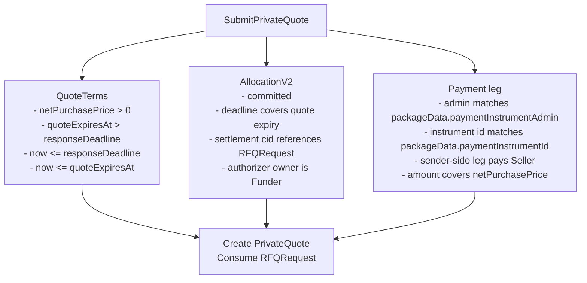
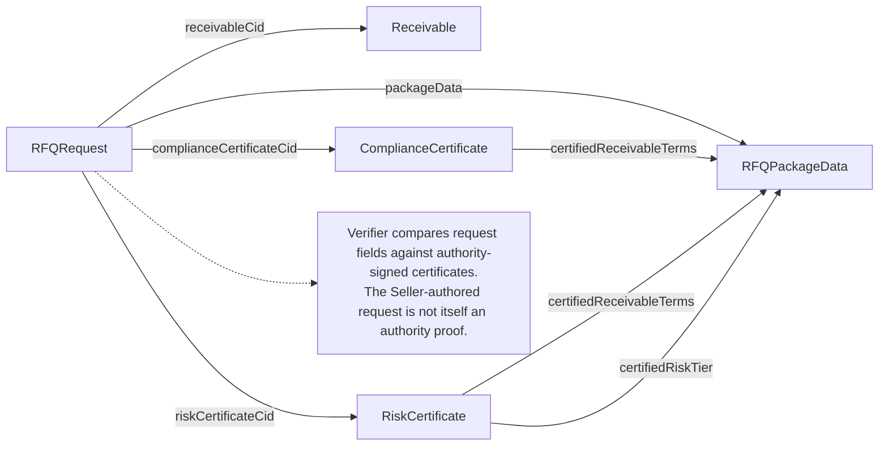
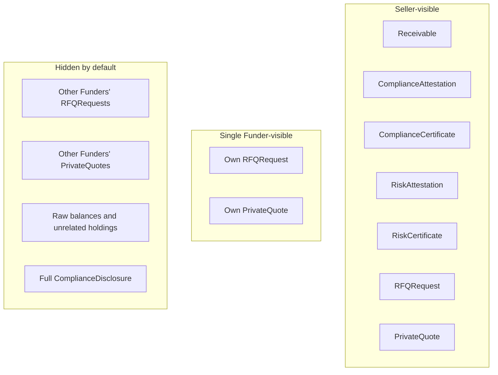
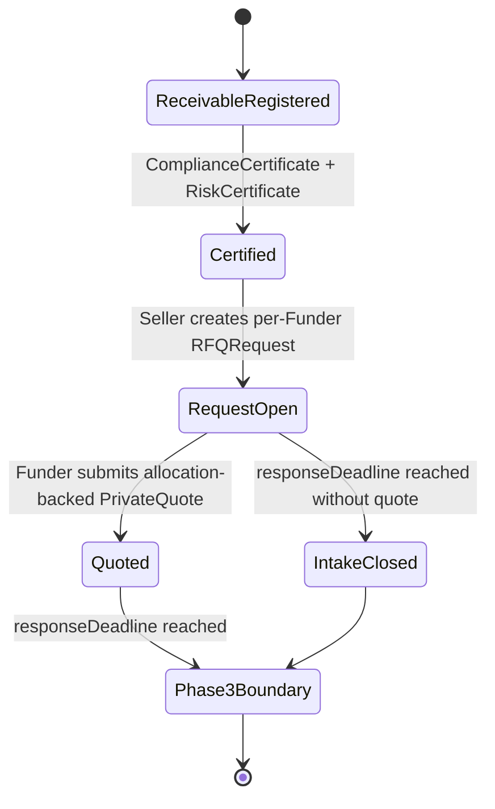
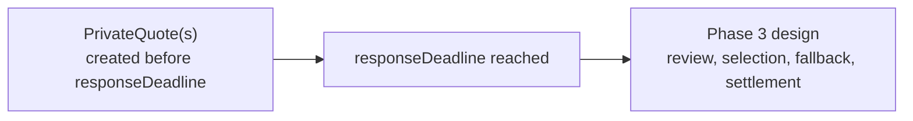

# CloakRFQ Workflow Diagrams

## Purpose

Diagram the current ledger workflow at a technical level.

This document reflects the implemented Phase 1 and Phase 2 scope. Phase 3 is shown only as a boundary because quote review, selection, fallback, and settlement are not implemented yet.

## Phase Boundary

## Implemented Contract Flow

## Phase 1 Sequence

## Phase 2 Sequence

## RFQRequest Validation Surface

## Authenticity Links

## Visibility Summary

## Current State Machine

## Phase 3 Boundary

