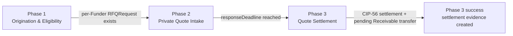
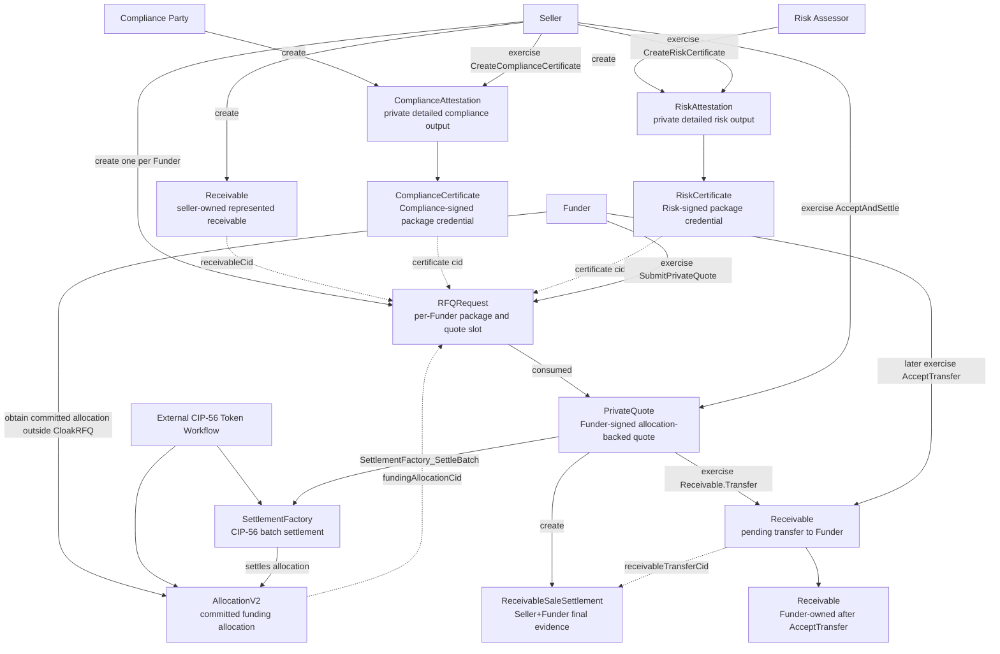
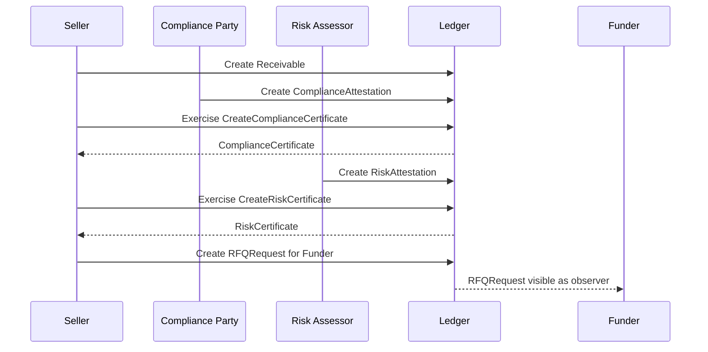
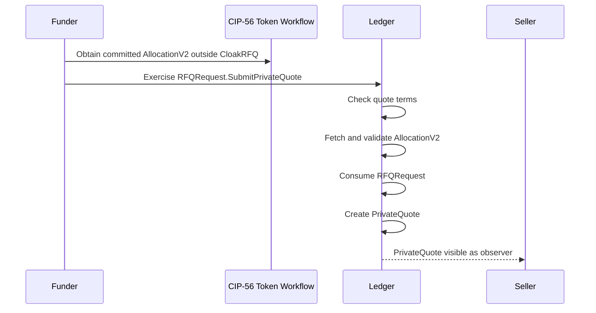
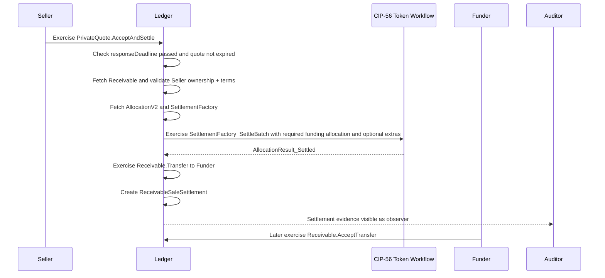
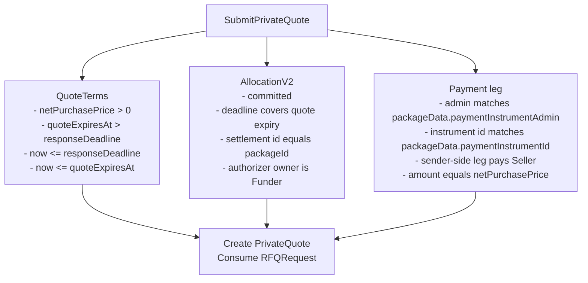
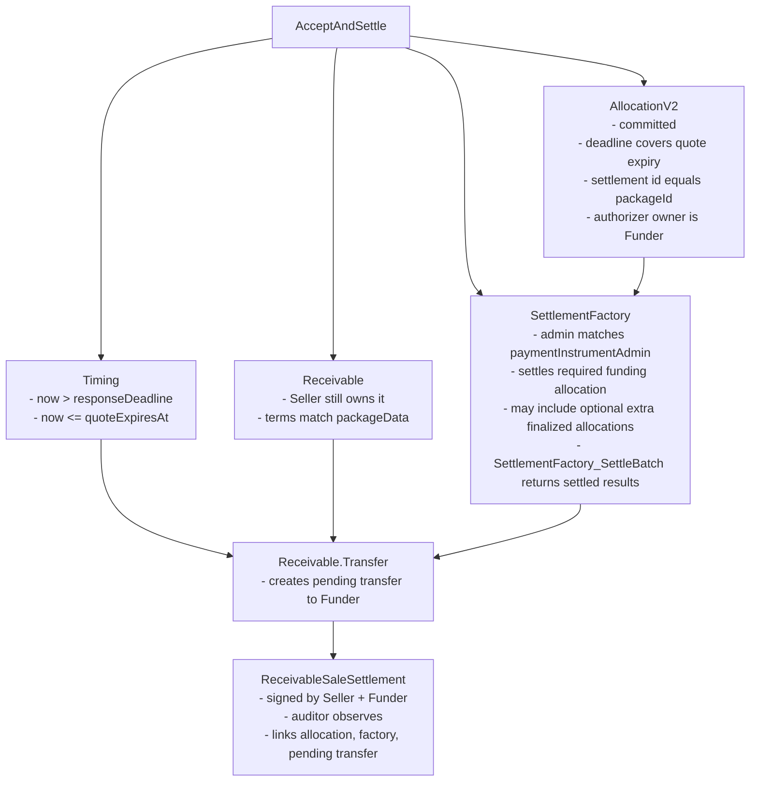
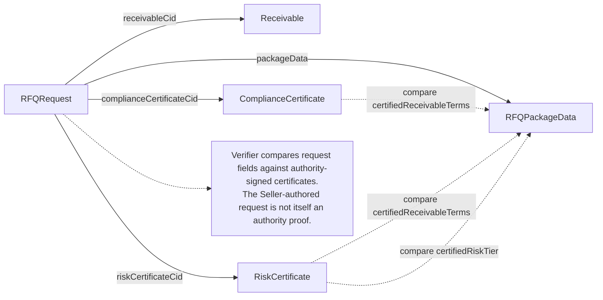
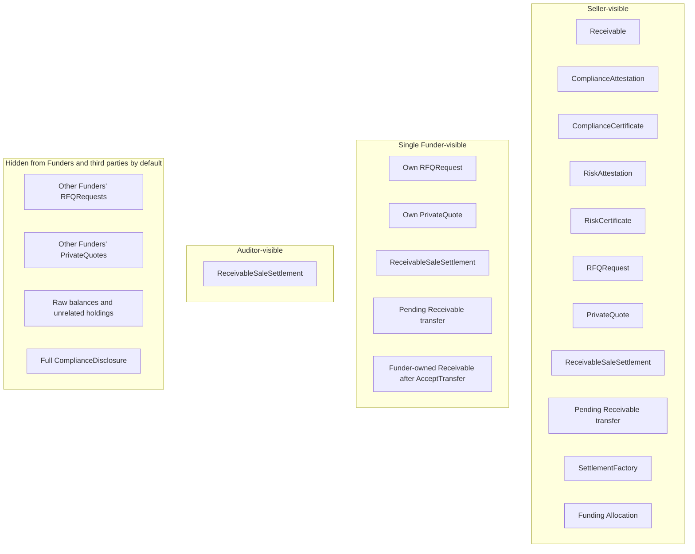
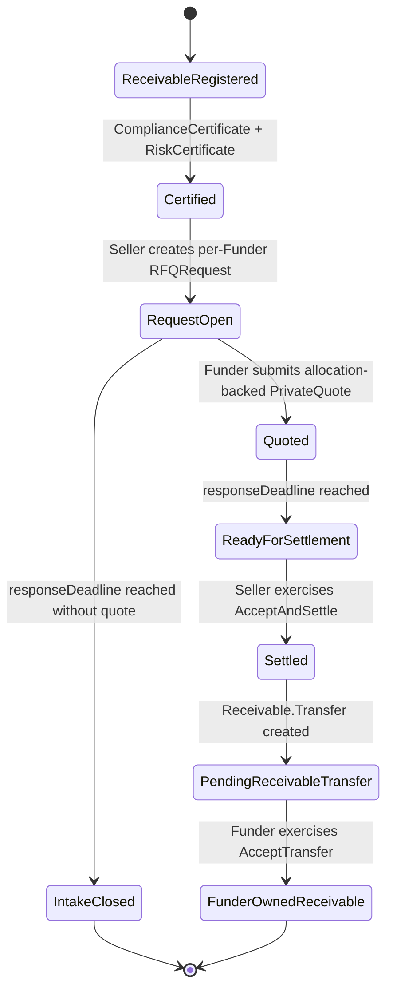

# CloakRFQ Workflow Diagrams

## Purpose

Diagram the current ledger workflow at a technical level.

This document reflects the implemented Phase 1, Phase 2, and Phase 3 happy-path settlement scope. Failure recording and fallback promotion are intentionally not modeled here yet.

## Phase Boundary

## Implemented Contract Flow

## Phase 1 Sequence

## Phase 2 Sequence

## Phase 3 Settlement Sequence

## RFQRequest Validation Surface

## AcceptAndSettle Validation Surface

## Authenticity Links

## Visibility Summary

## Current Happy-Path Lifecycle

This is the implemented happy-path lifecycle. There is no separate on-ledger close contract in Phase 2; the `responseDeadline` is enforced by `RFQRequest.SubmitPrivateQuote` and `PrivateQuote.AcceptAndSettle`.

